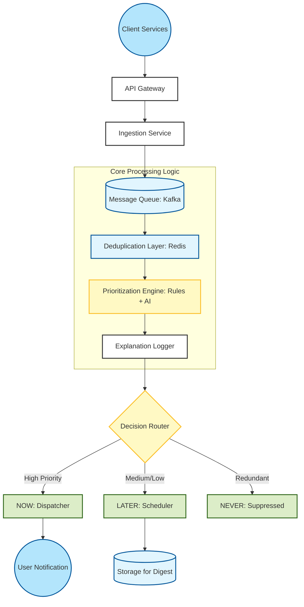

# Prioritization-Engine-Ai-solution
System architecture and decision logic for an AI-driven notification engine—handling high-volume events with Now/Later/Never classification.
[cite_start]This repository contains the system architecture and design for a Notification Prioritization Engine, developed for the **Cyepro Solutions** Round 1 Solution Crafting Test[cite: 1, 3]. [cite_start]The engine classifies incoming notification events into **Now, Later, or Never** to reduce alert fatigue and improve user experience[cite: 7, 11].

## 1. Problem Statement

Modern applications generate a large number of notifications from multiple services such as messages, reminders, alerts, updates, promotions, and system events.

The core problem is that users often receive:

- Too many notifications within short time periods
- Duplicate or near-duplicate alerts
- Low-value promotional messages mixed with critical alerts
- Notifications delivered at inappropriate times
- Important alerts that may be delayed or missed

This results in **alert fatigue**, reduced engagement, and poor user experience.

The objective of this system is to design a Notification Prioritization Engine that evaluates every incoming notification event and classifies it into:

- **NOW** – Send immediately  
- **LATER** – Defer or batch  
- **NEVER** – Suppress  

The system must operate under:

- High event volume (thousands per minute)
- Low-latency decision requirements
- Explainability and auditability
- Duplicate detection (exact and near)
- Human-configurable rules
- Fail-safe behavior when AI or services are unavailable

The goal is to deliver relevant notifications at the right time while minimizing noise and preserving user trust.

## 2. High-Level Architecture
[cite_start]The system is designed for high event volume and low latency[cite: 29, 30].

## 3. Decision Logic Design

To solve the problem of alert fatigue, the engine evaluates every incoming notification through a structured multi-stage classification pipeline.

### Classification Strategy

The system classifies each notification into one of three categories:

#### ✅ NOW (Immediate)
Reserved for:
- Time-sensitive alerts
- Critical system events
- High-priority messages
- Notifications with near expiry

These are sent instantly via the Dispatcher.

#### ⏳ LATER (Deferred)
Applied to:
- Medium/low priority notifications
- Promotional content
- Notifications arriving during high-frequency periods
- Notifications that can be batched into digest

### Multi-Stage Decision Flow

The engine evaluates notifications in the following order:

1. **Duplicate Check**
   - Check Redis for exact duplicate (dedupe_key or hash).
   - Perform similarity check for near-duplicates.

2. **Expiry Validation**
   - If current_time > expires_at → Suppress.

3. **User Fatigue Check**
   - Check cooldown window.
   - Check daily notification cap.
   - If exceeded → Defer or Suppress.

4. **Priority Evaluation**
   - Evaluate priority_hint.
   - Check event_type criticality.
   - Check urgency score from AI (if available).

5. **Final Classification**
   - High urgency → NOW
   - Medium urgency → LATER
   - Low value/noisy → NEVER

These are scheduled using the Scheduler service.

#### ❌ NEVER (Suppressed)
Applied when:
- Exact duplicate detected
- Near-duplicate detected
- Content expired
- User exceeded daily cap
- User opted out

All suppressed notifications are logged with a clear explanation.
LATER (Deferred): Notifications that are valid but arrive during high-frequency periods or are low-priority/promotional. These are scheduled for later delivery or batched into digests

NEVER (Suppressed): Applied to exact duplicates, near-duplicates, or content that has expired.

### Example Decision Scenario

Example:
Event: Payment reminder  
User already received 3 notifications in last 10 mins  
Priority: High  

Flow:
Duplicate check → Not duplicate  
Expiry check → Valid  
Fatigue check → Cooldown active  
Decision → LATER  

Explanation Logged:
"Deferred due to active cooldown window."

## 4. Data Model Design

The data model is designed to support:
- High throughput processing
- Real-time decision making
- Duplicate prevention
- Alert fatigue management
- Full auditability and explainability

The system uses a hybrid storage approach:
- In-memory store (Redis) for fast checks
- Relational/NoSQL DB for persistence
- Analytics store for monitoring & metrics

- ### Notification_Event

- notification_id (UUID, PK)
- user_id (Indexed)
- event_type
- source_service
- message_hash
- priority_hint
- channel (push/email/SMS/in-app)
- timestamp
- expires_at
- dedupe_key (nullable)
- metadata (JSON)
- processing_status (received / evaluated / failed)

### Notification_Decision

- notification_id (FK)
- user_id (Indexed)
- decision (NOW / LATER / NEVER)
- priority_score (0–100)
- ai_confidence_score (nullable)
- triggered_rules (JSON array)
- decision_reason (text)
- evaluated_at (timestamp)
- expires_at

### User_Notification_State

- user_id (PK)
- last_notification_sent_at
- cooldown_until
- notifications_sent_last_hour
- notifications_sent_today
- last_high_priority_event_at
- fatigue_score (dynamic score 0–100)
- updated_at

### Duplicate_Cache (Redis)

Key:
  user_id + message_hash

Value:
  last_sent_timestamp

TTL:
  5–15 minutes

### Recent_Message_Embeddings

- user_id
- message_embedding_vector
- timestamp

### Deferred_Notification

- notification_id
- user_id
- scheduled_for
- reason_for_deferral
- re_evaluation_required (boolean)

### Decision_Audit_Log

- audit_id
- notification_id
- decision
- explanation
- rules_triggered
- model_score
- fallback_used (boolean)
- system_latency_ms
- timestamp

### Design Considerations

- All high-frequency checks (duplicate, fatigue counters) use Redis for low latency.
- Historical data is stored in scalable NoSQL storage.
- Audit logs are streamed to analytics warehouse for monitoring.
- Indexes are applied on user_id and evaluated_at for fast retrieval.
- Write-heavy tables are append-only to handle high event volume.

## 5. Duplicate Prevention Strategy

To prevent notification spam and reduce alert fatigue, the system implements a multi-layer duplicate detection mechanism. The objective is to eliminate both exact duplicates and near-duplicates while maintaining low-latency performance under high event volume (thousands of events per minute).

Duplicate detection is executed early in the pipeline to minimize unnecessary AI computation and system load.

---

### 5.1 Exact Duplicate Detection (Fast Path)

The first layer performs deterministic duplicate detection using a short-lived in-memory cache (Redis).

**Approach:**
- If `dedupe_key` is provided → use it directly.
- If missing → generate a deterministic hash:

  hash(user_id + event_type + normalized_message)

- Store the hash in Redis with a TTL of 5–15 minutes.
- If the key already exists → classify notification as **NEVER**.
- Log explanation:
  "Suppressed as exact duplicate within time window."

**Why this works well:**
- O(1) lookup
- Millisecond latency
- Handles burst traffic efficiently
- Prevents immediate repeat spam

---

### 5.2 Time-Window Deduplication (Event Flood Protection)

Some services may generate rapid repeated events.

**Example:**
10 system alerts triggered within 30 seconds.

**Strategy:**
- Maintain a counter per (user_id + event_type) in Redis.
- If event frequency exceeds a defined threshold within a short window:
  - Collapse into a single notification
  - Or classify as **LATER**
  - Or suppress if non-critical

This protects users from system-generated event floods.

---

### 5.3 Near-Duplicate Detection (Semantic Similarity)

Exact string comparison is insufficient because messages can be slightly reworded.

**Example:**
- "Your payment was successful"
- "Payment completed successfully"

**Strategy:**
- Convert notification message into an embedding vector.
- Compare it with recent notifications for that user.
- Compute cosine similarity.
- If similarity > threshold (e.g., 0.85) → classify as **NEVER**.

To maintain performance:
- Only compare against recent N messages (e.g., last 20).
- Store embeddings temporarily with TTL.

This prevents semantically identical notifications from bypassing exact-match checks.

---

### 5.4 Cross-Channel Deduplication

Users may receive the same event across multiple channels (Push, Email, SMS).

**Policy:**
- Critical alerts → Multi-channel allowed.
- Promotional notifications → Single-channel only.
- If same event already delivered via one channel → suppress redundant channels.

This prevents multi-channel overload while preserving important alerts.

---

### 5.5 Duplicate Audit Logging

Every suppressed duplicate is recorded for transparency and auditability.

**Stored Fields:**
- notification_id
- duplicate_type (exact / near / flood / cross-channel)
- matched_reference_id
- timestamp
- suppression_reason

This ensures:
- No silent loss of important notifications
- Debug capability
- Full explainability

---

### Design Considerations

- Duplicate checks occur before AI scoring to reduce computational cost.
- Redis is used for high-frequency short-term validation.
- TTL-based expiration prevents memory bloat.
- Historical comparisons are limited to recent data for scalability.
- If the deduplication layer fails, critical notifications default to **NOW** instead of being silently dropped.

---

### Outcome

This multi-layer duplicate prevention strategy ensures:
- Exact duplicates are eliminated instantly.
- Flood scenarios are controlled.
- Reworded spam is detected.
- Cross-channel redundancy is minimized.
- The system remains scalable, explainable, and production-ready.

## 6. Alert Fatigue Strategy

To prevent users from feeling overwhelmed, the system implements a dynamic Alert Fatigue Management framework. 
The objective is to balance user engagement with notification relevance, ensuring important alerts are delivered while reducing unnecessary noise.

The fatigue strategy works in real-time using user state tracking and adaptive thresholds.

---

### 6.1 Cooldown Window Enforcement

To avoid rapid consecutive notifications:

- Each user has a `cooldown_until` timestamp.
- If a new notification arrives before cooldown expires:
  - High-priority → Allowed (override cooldown)
  - Medium-priority → Classified as LATER
  - Low-priority → Suppressed

**Example:**
If a user received a push notification 2 minutes ago and cooldown is 10 minutes:
- Promotional message → LATER or NEVER
- Security alert → NOW

This prevents clustering of notifications within short time spans.

---

### 6.2 Daily and Hourly Caps

The system enforces configurable caps:

- Max notifications per hour (e.g., 5)
- Max notifications per day (e.g., 20)

If limits are exceeded:
- Critical alerts → Always delivered
- Non-critical → Deferred or suppressed

Counters are maintained in Redis for low-latency evaluation.

This ensures users are not overloaded throughout the day.

---

### 6.3 Priority-Aware Throttling

Not all notifications are equal.

Each event is assigned a dynamic priority score based on:
- Event type criticality
- Time sensitivity
- User engagement history
- AI confidence score

Decision thresholds:
- Score > 80 → NOW
- Score 40–80 → LATER
- Score < 40 → NEVER (during noisy periods)

This ensures that high-value notifications are never blocked by fatigue controls.

---

### 6.4 Batching & Digest Mode

Low-priority notifications are grouped into scheduled digests.

Instead of sending 10 individual promotional notifications:
- They are combined into a single summary notification.
- Delivered at optimized time slots.

Example:
"You have 5 new offers available."

This significantly reduces perceived notification noise.

---

### 6.5 Adaptive Fatigue Scoring

Each user maintains a dynamic `fatigue_score` (0–100), updated based on:

- Notifications sent recently
- User interaction rate (open/click)
- Suppression frequency
- Time of day

If fatigue_score exceeds threshold:
- System becomes stricter in sending low-priority alerts.
- Only critical notifications are delivered.

This enables personalized notification frequency control.

---

### 6.6 Quiet Hours & Context Awareness

The system respects user-defined or inferred quiet hours.

During quiet hours:
- Only critical alerts are sent.
- Other notifications are deferred.

Context signals such as:
- Time zone
- Do-not-disturb settings
- Recent inactivity

are considered before sending notifications.

---

### 6.7 Transparency & Logging

Every fatigue-based decision is logged with:

- fatigue_score at decision time
- rule triggered (cooldown / cap / digest / quiet hours)
- final classification

This ensures:
- Full explainability
- No silent suppression
- Auditable decision-making

---

### Design Considerations

- Fatigue checks are O(1) using cached user state.
- Thresholds are configurable without redeployment.
- Critical notifications always override fatigue restrictions.
- Digest scheduling reduces overall notification volume.
- The system favors deferral over suppression when possible.

---

### Outcome

This alert fatigue framework ensures:

- Users are not overwhelmed.
- Important notifications are never missed.
- Low-value notifications are intelligently delayed or batched.
- Engagement and user trust are preserved.
- The system remains scalable and production-ready.

## 7. API & Service Interfaces

The Notification Prioritization Engine exposes a set of well-defined APIs to ensure seamless integration with multiple upstream services and downstream delivery systems.

The APIs are designed to be:
- Low latency
- Idempotent
- Scalable
- Auditable

---

### 7.1 Evaluate Notification

**Endpoint:**
POST /notifications/evaluate

**Purpose:**
Evaluates an incoming notification event and returns a classification decision (NOW / LATER / NEVER) along with explanation.

**Request Payload Example:**
{
  "user_id": "U123",
  "event_type": "payment_reminder",
  "message": "Your electricity bill is due tomorrow",
  "priority_hint": "high",
  "channel": "push",
  "timestamp": "2026-02-25T10:00:00Z",
  "expires_at": "2026-02-26T00:00:00Z"
}

**Response Example:**
{
  "decision": "NOW",
  "priority_score": 87,
  "reason": "High priority and no fatigue restriction",
  "cooldown_applied": false
}

---

### 7.2 Get Audit Details

**Endpoint:**
GET /notifications/{notification_id}/audit

**Purpose:**
Fetches detailed decision explanation for transparency and debugging.

**Response Includes:**
- decision
- triggered_rules
- fatigue_score
- duplicate_type
- model_score
- evaluation_timestamp

---

### 7.3 Update Rule Configuration

**Endpoint:**
POST /rules/update

**Purpose:**
Allows human operators to modify:
- Cooldown duration
- Daily caps
- Priority thresholds
- Duplicate time windows

This avoids full code redeployment for policy changes.

---

### 7.4 Get User Notification State

**Endpoint:**
GET /users/{user_id}/state

**Purpose:**
Returns current user fatigue metrics such as:
- notifications_sent_today
- cooldown_until
- fatigue_score
- last_notification_time

Used for monitoring and customer support.

---

### API Design Considerations

- All APIs are idempotent.
- Authentication via API keys or OAuth.
- Rate limiting enforced at API Gateway.
- Responses include explanation metadata for auditability.
- Timeouts enforced to prevent blocking behavior.
- Versioning supported (e.g., /v1/notifications/evaluate).

---

### Outcome

These APIs ensure:
- Clear integration with upstream services.
- Real-time decisioning capability.
- Transparent audit support.
- Operational flexibility without redeployment.

## 8. Fallback Strategy (Resilience & Fail-Safe Design)

The Notification Prioritization Engine is designed to fail safely under partial system failures. 
The system ensures that important notifications are never silently lost, even if AI models or dependent services become slow or unavailable.

The fallback strategy prioritizes availability, safety, and graceful degradation.

---

### 8.1 AI Model Timeout Handling

AI scoring is optional enhancement, not a hard dependency.

- AI inference has a strict timeout (e.g., 100ms).
- If AI response exceeds timeout:
  - System automatically switches to rule-based decision logic.
- Critical notifications default to NOW.
- Non-critical notifications follow deterministic rules.

This ensures low latency and avoids blocking user-facing decisions.

---

### 8.2 Rule-Based Safe Mode

If AI service is completely unavailable:

- Duplicate detection still runs.
- Fatigue checks still run.
- Deterministic priority rules are applied.

Decision priority order in safe mode:
1. Security / system-critical → NOW
2. Time-sensitive alerts → NOW
3. Medium priority → LATER
4. Promotional → NEVER (during high traffic)

This guarantees business continuity without ML dependency.

---

### 8.3 Cache / Redis Failure Handling

If Redis (dedupe or fatigue cache) becomes unavailable:

- System temporarily relaxes duplicate strictness.
- Critical notifications are still delivered.
- Short-term in-memory fallback counters are used.
- Error is logged and alert triggered for operations team.

The system never drops notifications silently due to cache failure.

---

### 8.4 Message Queue Backlog Handling

If processing backlog increases:

- Auto-scale consumer instances.
- Apply load shedding for low-priority notifications.
- Delay non-urgent notifications.
- Protect critical event processing lanes.

This prevents system collapse during traffic spikes.

---

### 8.5 Circuit Breaker Pattern

To avoid cascading failures:

- If AI service repeatedly fails → circuit breaker activates.
- System routes all decisions through rule engine temporarily.
- Periodic health checks attempt recovery.

This isolates failure domains and maintains stability.

---

### 8.6 Expiry-Aware Safeguard

If a notification becomes stale during processing delay:

- If current_time > expires_at → classify as NEVER.
- Log explanation: "Suppressed due to expiration during delay."

This prevents delivery of outdated alerts.

---

### 8.7 Observability & Alerting

All fallback activations are logged with:
- fallback_reason
- affected_component
- latency
- timestamp

Monitoring dashboards track:
- AI timeout rate
- Redis failure rate
- Queue backlog size
- Fallback activation frequency

This ensures rapid detection and remediation.

---

### Design Principles

- AI is an enhancement, not a dependency.
- Critical notifications always take precedence.
- No notification is silently lost.
- Graceful degradation over system crash.
- Fail open for critical, fail closed for promotional.

---

### Outcome

The system remains:
- Highly available
- Resilient to service failures
- Low latency
- Explainable
- Safe for critical notifications

This ensures reliable operation even under partial outages or high load conditions.

## 9. Metrics & Monitoring Plan

The Notification Prioritization Engine is designed with full observability to ensure performance, reliability, and continuous optimization.

The monitoring framework tracks system health, decision quality, and user impact.

---

### 9.1 System Performance Metrics

To ensure low-latency decisioning under high volume:

- Average decision latency
- P95 and P99 response time
- Throughput (events per minute)
- Queue processing lag
- API error rate
- AI inference latency

Target:
- Most decisions < 100ms
- Zero critical notification loss

---

### 9.2 Decision Distribution Metrics

To validate prioritization effectiveness:

- % classified as NOW
- % classified as LATER
- % classified as NEVER
- Duplicate suppression rate
- Fatigue-based suppression rate
- Fallback activation rate

These metrics help identify:
- Over-suppression issues
- Alert flooding
- Misconfigured thresholds

---

### 9.3 User Engagement Metrics

To measure notification quality:

- Open rate (push/email)
- Click-through rate (CTR)
- Conversion rate
- Unsubscribe rate
- User churn after notifications

If engagement drops:
- Re-evaluate fatigue thresholds
- Adjust scoring weights
- Tune duplicate similarity threshold

---

### 9.4 Alert Fatigue Indicators

To monitor user experience:

- Average notifications per user per day
- Fatigue score distribution
- Digest usage rate
- Cooldown-trigger frequency

This ensures users are not overwhelmed.

---

### 9.5 Reliability & Resilience Metrics

To detect system instability:

- AI timeout rate
- Circuit breaker activation count
- Redis failure rate
- Fallback usage percentage
- Expired-notification suppression count

High fallback rate may indicate:
- AI degradation
- Infrastructure instability

---

### 9.6 Logging & Observability Stack

- Structured logging for all decisions
- Centralized log aggregation
- Real-time dashboards
- Automated alerting for anomalies

Dashboards include:
- Latency trends
- Suppression trends
- Engagement trends
- System health overview

---

### 9.7 Continuous Improvement Loop

Metrics are used to:

- Adjust priority thresholds
- Tune duplicate detection sensitivity
- Improve AI scoring accuracy
- Optimize fatigue limits

All rule updates are configurable without redeployment.

---

### Outcome

This monitoring strategy ensures:

- Real-time visibility into system performance
- Early detection of failures
- Continuous optimization of decision quality
- Protection of user experience
- Data-driven improvement of notification effectiveness

## 10. Tools Used

The following tools were used during the design and documentation of this solution:

- ChatGPT – Used for brainstorming architecture patterns and refining documentation structure.
- Manual Design Refinement – All system design decisions, trade-offs, and final structure were manually reviewed and organized.
- Draw.io – Used to create the high-level architecture diagram.
- Markdown (GitHub) – Used for structured documentation and presentation.

### Note on AI Usage

AI tools were used to accelerate idea exploration and documentation clarity. 
All final architectural decisions, system flows, trade-offs, and technical justifications were critically evaluated and structured manually.

The solution reflects independent system design thinking aligned with real-world production considerations.
